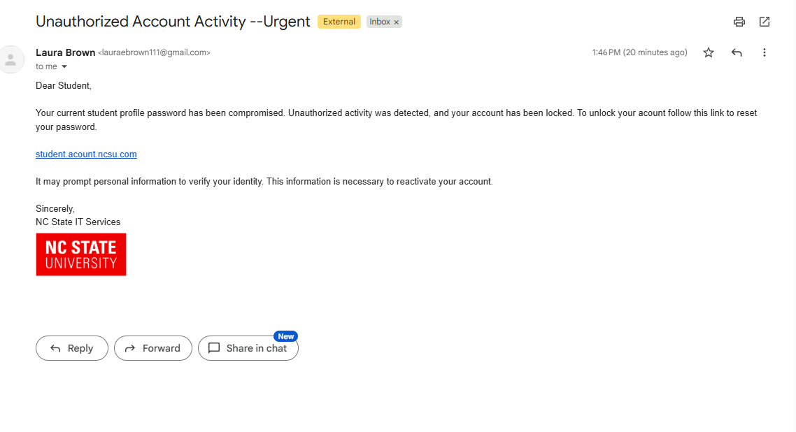
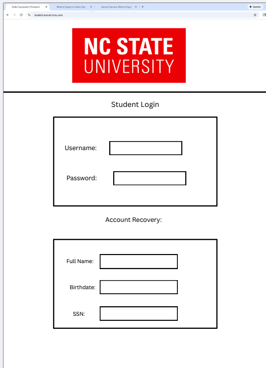
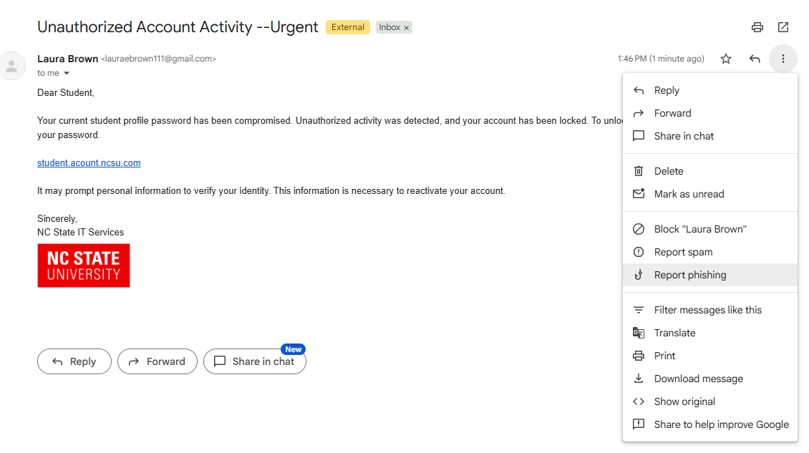

# Phishing Email Awareness Procedure
## Purpose
The purpose of this procedure is to instruct students how to identify and report phishing emails.

<!-- maybe just "Identify and report phishing emails" because the heading already tells us that the content following is the purpose -->

## Definitions
- Phishing: A cyber-attack that attempts to get you to reveal personal information to steal your identity or money on websites that pretend to be legitimate.
- Threat Actors: Any cyber-criminal who is attempting to gain access or information illegally. 
## Content
<!-- maybe this content should be previewed under "purpose"? -->
1. Identifying the Email
2. What to do with a Phishing Email
3. What to do if the Phishing Attack is Successful
4. Answers

<!-- Let's try to make these parallel in their construction, if they are all tasks -->

## Identifying the Email
1. Look at the sender's address. Often threat actors will attempt to impersonate familiar people or organizations. When inspecting a suspicous email check the address for variations from who is being impersonated. <!-- try to keep the explanation out of the step. Your second sentence is really a lead in piece of information. The first and third sentences seem to say the same thing -->
2. Check the content of the email for red flags. These may include: <!-- "... which may include" -->
   - Poor spelling or grammar
   - Created sense of urgency
   - Genaric greeting <!-- spelling -->
   - Suspicous links or attatchments
   - Mispelled or unrelated sense <!-- not sure what you mean by an "unrelated sense" -->
   - Requests for sensitive information
   - Unusual logos or branding
3. Analyze the following email. How many red flags does it have? 
<!-- not really a step. It is more of an illustration -->
 
   Figure 1: Example Phishing Email

4. The awnser can be found in the Awnser section. <!-- spelling. Also not a step -->
5. If you click on the link, analyze the website for red flags. These may include: <!-- but you shouldn't click on the link, right? -->
    - Requests for sensitive information
    - Unusual or off-looking desing or branding <!-- spelling -->
    - Misspelled URL
    - Grammar or spelling mistakes
6. Analyze the following website. How many red flags does it have? 

Figure 2: Example Pishing Website

7. The awnser can be found in the awnser section. <!-- note that you are using numbered steps for information that I would call explanation or illustration or examples, but numbering all of them suggest that they are the same kind of information -->
## What to do with a Phishing Email
1. Do not click on any links or attatchments within the email. <!-- right ... see my comment on step #5 in last section -->
   
   **Caution**: Clicking a link or attatchment can expose the device to cyber threats like identity theft and malware installation. <!-- Maybe lead off this section with that warning as a pre-requisite piece of information. The current placement suggests that it is a caution to observe when following the first step, which is a negative step about what not to do, rather than a positive step about what to do-->
2. Report the message by clicking on the three dots in the left corner. A drop-down menu will appear. Click on Report Phishing. <!-- multiple steps? -->

Figure 3: Path <!-- annotate the image with numbers to highight that it is a path of sequential actions being shown? -->

3. Delete the message to reduce the risk of clicking on it later. 
## What to do if the Phishing Attack is Successful. 
1. Write down as many details about the attack as you can remember. Take particular care to write down any information that was shared. 
2. Change the passwords on all impacted accounts. This may prevent further breaches. 
3. Confirm that multifactor authentication is enabled on every other account. This will further improve the saftey of your account. 
4. Notify the IT department of the possible attack. <!-- additional information that could be useful to students? -->
Motify any external agency that may have been affected. Ex. If you submitted a password that you also use for your bank account, the bank should be notified of the possible fraudlent activity. <!-- spelling -->
## Answers 
1. The email:
   - There is a created sense of urgency in the subject line.
   - There is a generic greeting.
   - Account is misspelled
   - The link provided is genearic and suspicous
2. The website:
   - The website design is not within typical NC State Branding, despite the logo.
   - The site requests unnecessary and sensitive information.
   - The URL is misspelled. 
